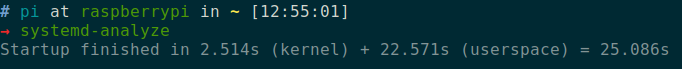
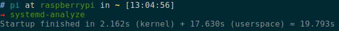
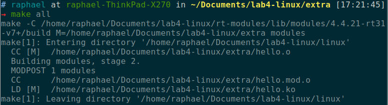
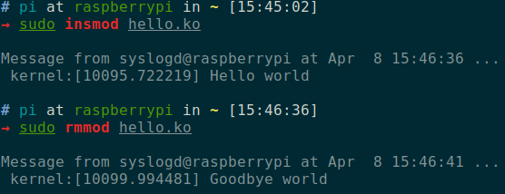

# Lab 4
*Par Yoan PIDERI, Floriane THOCQUENNE et Raphaël CASIMIR*

Le but de ce lab est de compiler le noyau linux d'une raspberry pi avec une configuration d'ordonnanceur adaptée pour une utilisation temps-réel.

## Cross-compilation et installation d'un noyeau temps-réel

1. La première étape est de télécharger la version du noyau qui tourne déjà sur la raspberry pi, pour éviter toute incompatibilité. Pour cela nous avons cloné le repo github du noyau de la raspberry puis nous sommes retourné au commit correspondant à notre noyeau en utilisant l'outil "get_hash.sh" fourni ainsi que la commande `git checkout <numero_du_commit>`. De cette manière nous sommes certains d'avoir exactement la même version que celle compilée sur la raspberry.

2. Ensuite nous avons téléchargé et appliqué le patch PREMPT-RT correspondant à notre version de noyau. La commande "patch" est un outil pratique permettant de ne télécharger que la différence entre notre version des fichiers source et la version que nous voulons atteindre.

3. Nous avons ensuite utilisé modprobe et zcat sur la Pi pour générer un fichier .config qui contient la configuration noyeau actuelle. Cette configuration a été importée sur la machine de compilation, puis modifiée en utilisant `menuconfig` pour sélectionner la nouvelle configuration d'ordonnanceur activable grâce au patch.

4. Pour pouvoir faire la cross-compilation, c'est à dire compiler le noyau de la Pi sur un ordinateur avec une architecture différente, il faut exporter les variables `ARCH=arm` et `CROSS_COMPILE=<emplacement_du_fichier_tools_fourni>/` `arm-bcm2708/gcc-linaro-arm-linux-gnueabihf-raspbian-x64/bin/arm-linux-gnueabihf-` . Cela précise au compilateur l'architecture cible et les outils de cross-compilation à utiliser.

5. En utilisant `make zImage -j<nombre de threads à utiliser>` puis `make modules -j<X>`, `make dtbs` et enfin `make modules_install` on génère une version compilée du noyeau, puis des modules, puis le "blob d'arborescence matérielle", qui permet entre autres au système de gérer de manière fiable les accès concurents aux ressources matérielles.

6. Ensuite nous générons une image du noyeau en format img que nous placons dans notre arborescence de travail.

```
./scripts/mkknlimg ./arch/arm/boot/zImage $INSTALL_MOD_PATH/boot/kernel7.img
```

\newpage

7. Ensuite nous avons copié les device tree et overlays générés précédement dans le fichier boot crée à la racine de notre architecture de travail puis avons compressé et transféré le tout sur la raspberry.

8. Finalement, nous avons pu fusionner l'arborescence générée avec celle de la raspberry. Après un redémarrage, on peut en effet voir que le noyeau est en mode préemptible.


9. La commande chrt permet de lancer un process avec une politique d'ordonnancement spécifique. Par exemple `sudo chrt -f -p 20 23705` lance le processus 23705 avec la politique `SCHED_FIFO` et la priorité 20.

## Optimisation du temps de démarrage

En utilisant une adresse ip statique (modifier /ect/networks/interfaces), on obtient un temps total de démarrage réduit d'environ 25%.





## Création d'un module kernel

Voici le module kernel simple que nous avons écrit :

```c
// Début module
#include <linux/module.h>	/* Needed by all modules */
#include <linux/kernel.h>	/* Needed for KERN_INFO */

int init_module(void)
{
	printk(KERN_EMERG "Hello world\n");

	return 0; // If it doesn't return 0, the module failed to start
}

void cleanup_module(void)
{
	printk(KERN_EMERG "Goodbye world\n");
}

MODULE_LICENSE("MIT");
MODULE_DESCRIPTION("Gooblox generator. Generates Goobloxes of the finest quality.");
MODULE_AUTHOR("Jarjar Binks");
// Fin module
```

*Note:* les fonctions `init_module` et `cleanup_module` peuvent en réalité être renommées, à condition de préciser leur nom dans les fonctions suivantes :

```c
module_init(init_function);
module_exit(cleanup_function);
```

et d'inclure ces indications compilateur apprès la définition desdites fonctions, dans le fichier `.c`, en dehors de toute autre fonction.

On peut remarquer l'utilisation de la priorité `KERN_EMERG` pour les messages. Il s'agit de la priorité de messages la plus forte, et c'est la seule qui a permis d'afficher un message dans le terminal lors du chargement / déchargement du module. Cependant les messages de priorité inférieure s'ajoutaient bien au fichier `/var/log/messages`.

\newpage
Voici le fichier makefile associé au module :

```bash
# Début makefile
obj-m += hello.o

all:
	make -C $(INSTALL_MOD_PATH)/lib/modules/4.4.21-rt31-v7+/build M=$(PWD) modules

clean:
	make -C $(INSTALL_MOD_PATH)/lib/modules/4.4.21-rt31-v7+/build M=$(PWD) clean
# Fin makefile
```

Après compilation avec `make all` on obtient entre autres un fichier `.ko` :



La sortie texte du module se fait bien comme prévu.



## Remerciements

Le site [The Linux Documentation Project](https://www.tldp.org/) nous a été d'une aide précieuse quand à la rédaction et compilation de notre module.