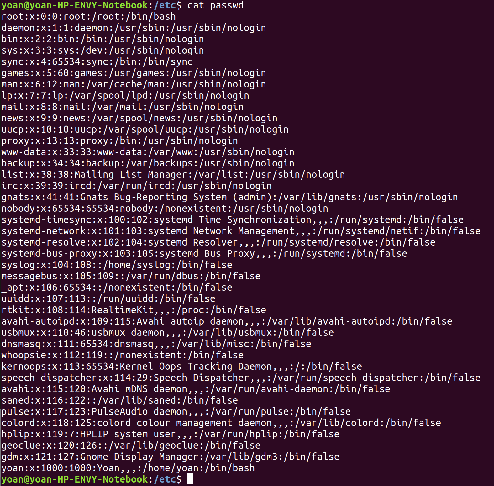

# Test lab

*Raphael CASIMIR - Yoan PIDERI - Floriane THOCQUENNE*

**1.1** : Dans l'invite de commande, "~" est un accès rapide à `$HOME`, la variable d'environnement contenant le dossier utilisateur. Exemple : `$ echo ~` renvoie `/home/raphael`

**1.2** :

* `VV=3` : Crée une variable nommée VV valant 3, et visible uniquement dans le shell actuel
* `export VV` : modifie la portée de la variable. Elle a désormais une portée globale, copiée dans tous les programmes exécutés dans le contexte local.
* `bash` : Lance l'interpréteur de commande "bash". 
* `unset VV` : Supprime la variable dans le shell actuel / local. 
* `exit` : Quitte le bash actuel. 
* `echo $VV` : Renvoie 3 car la variable n'a pas été supprimée dans cet environnement
 \ No newline at end of file 
* `echo $VV` : Renvoie 3 car la variable n'a pas été supprimée dans cet environnement 
 
**1.3** : Dans le cas présent, la commande alias permet de réattribuer '/usr/bin/ls' vers '/home/user/ls' : `alias ls='/home/user/ls'` 
 
**1.4** :  
 
* `flex text.txt` : met text.txt en entrée de la commande flex 
* `flex text.txt 2>resu.txt` : récupère le stderr de la commande flex text.txt et le copie dans resu.txt . 

 \newpage

**1.5** : Voici le fichier passwd complet : 



La ligne de commande à entrer pour afficher la ligne du milieu est `head -n $(($(wc -l passwd | cut -d ' '-f1)/2))`


 
**1.6** : La ligne de commande à entrer pour changer le propriétaire actuel du fichier en root est `sudo chown $(ls -al file.txt | cut -d’ ’ -f3) file2.txt` : 
 
On utilise `sudo chown <nom du nouveau propriétaire> <nom du fichier>` pour modifier le propriétaire du fichier

  
 
`ls -al file.txt` affiche les informations du fichier file.txt notamment le propriétaire. 
  
`cut -d ' ' -f3` sélectionne la troisième colonne qui, dans notre cas correspond au nom du propriétaire. Si le propriétaire est root, par exemple, $(ls -al | grep file.txt | cut -d’ ’ -f3) vaut 'root'.  
 
 
**2.1** 
Voici la commande complète `cut -d ':' -f3 /etc/passwd | grep ^[1-9][0-9][0-9][02468][0-9]*[02468]*`. 


On utilise `cut -d ':' -f3` pour isoler les numéros de user ID. Puis on pipe avec `grep ^[1-9][0-9][0-9][02468][0-9]*[02468]*`. Cette commande sélectionne les nombres à trois ou quatre chiffres (donc supérieur ou égal à 100 ou 1000) qui se terminent pas 0,2,4,6 ou 8. 
 
**2.2** 
Voici la commande permettant d'  afficher l'adrese IP wifi contenu dans le retour d'ifconfig : `ifconfig | grep -1 enp0s3 | cut -d' ' -f10`


Remarque : Sur cette image, le nom du réseau est wlp1s0.
 
`grep -1 enp0s3` affiche la première ligne contenant 'enp0s3' qui contient également l'adresse recherchée. Elle se trouve à la dixième colonne donc on utilise un cut délimité par des espaces : `cut -d' ' -f10`. 
 
**3.1** 
Voici le script demandé : 


`lines=$(wc -l /etc/passwd | cut -d' ' -f1)` affiche uniquement le nombre de ligne du fichier. Sans la commande `cut` on obtient : 41 passwd.
On crée une boucle for pour parcourir les 41 lignes du fichier où i sera le numéro de la ligne à traiter. `seq 1` indique que l'on incrémente i de 1.


```bash
head -$i /etc/passwd | tail -1 | sed -n "s/\([^:]*\):\([^:]*\):\([^:]*\):\([^:]*\):.
*/Username : \1, Passeword : \2, UID : \3, GID : \4/p";
```

Cette ligne permet d'afficher une seule ligne selon un format souhaité. On commence par sélectionner une ligne avec head et tail. head sélection les i premières lignes et tail -1 sélectionne la dernière. `sed -n` permet d'effectuer des modification sur le texte. Le "s/../../" signifie que nous allons remplacer le premier par le deuxième terme. Ici on remplace tout ce qu'il y a avant les ':' par Username et on affiche ce qu'il y a après les ':'. De même pour les 3 autres informations.
